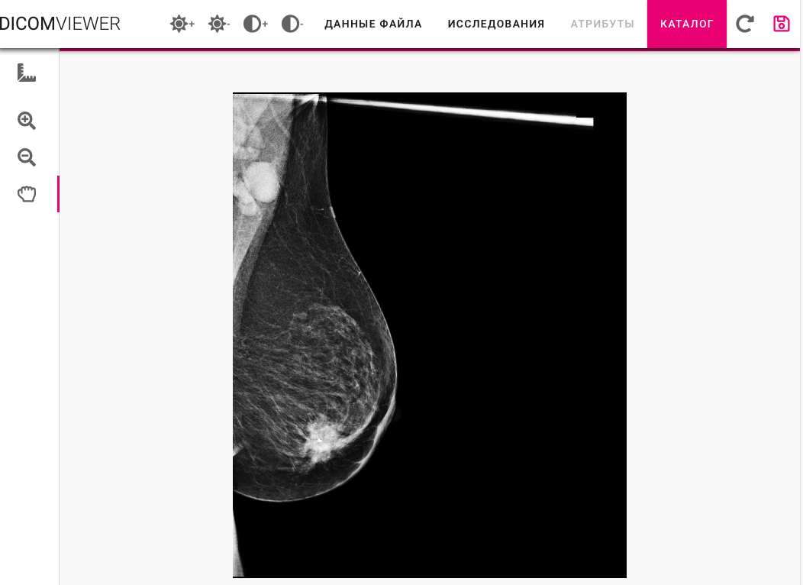
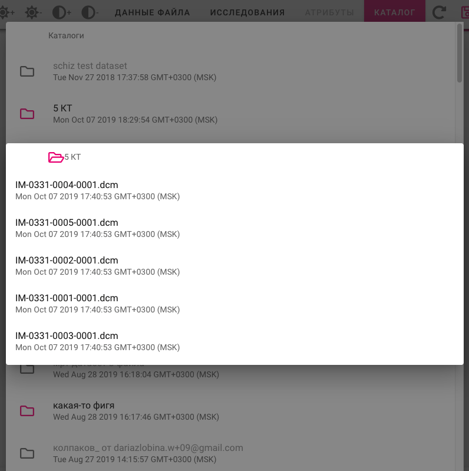
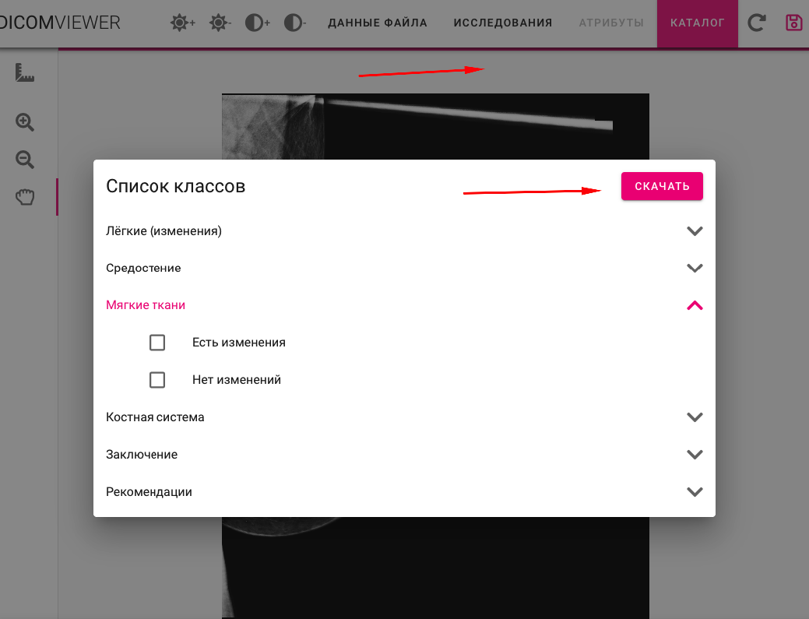

#   Программа  испытаний 

Исходные данные:

- [Система развернутся из исходного кода](https://zsegmentationst.cobrain.io)
- [Экспериментальная система](http://vps.cobrain.io)
- [Исходный код](https://gitlab.cobrain.io/external/zsegmentation) 
Ветвь [`master`](https://gitlab.cobrain.io/external/zsegmentation/commits/master)

## Общие результаты проекта 

-   Реализована платформа, обеспечивающая доступ пользователей (экспертных команд-асессоров) специализированному инструменту разметки результатов медицинских исследований в формате веб-сервиса;

      Считаем что это собственно платформа и есть 

-   Проведена адаптация пользовательского интерфейса модуля разметки под запрос Заказчика;
  

     Считаем что это done.  Хотя последний взгляд на интерфейс надо кинуть 

-   Реализованы инструменты обеспечения безопасности;

 
  считаем что это OAUTH и что он реализован. 

-  Проведено обучение пользователей и оператора Заказчика для дальнейшей эксплуатации и обеспечения администрирования платформы.
-    Подготовлена документация и исходный код конечного модуля разметки в соответствии с гайдом Заказчика
    

 
Смотрим чтобы была пользовательская документация  или то из чего он делается.  в том числе и комментарии в коде, если что 

 
Укажите  PLEASE на места где сохранена хоть какая-то пользовательская документация.  наверно кстати и отчет должен ссылаться на эти места в GITе по каждой из функций которая требует документации

## Общие требования 

1.  Структурирование предоставленной информации (атрибутивный состав) и сохранение ее в хранилище данных.

2.  Возможность редактирования DICOM-снимков

3.  Администрирование:
-   управление файлами;
-   логирование событий системы.

Ниже приведен детализированный перечень функций в соответствии с обозначенными требованиями в разбивке по предлагаемым этапам реализации.

##   Функциональные Требования 

- Пользовательский интерфейс должен быть реализован на базе WEB   технологии с поддержкой основных современных распространенных браузеров, (Chrome, Firefox, Internet Explorer, Safari) 

 
C  Internet Explorer  не работает. 

- Дизайн интерфейса должен быть согласован с Заказчиком в рабочем порядке на основании дополнительного соглашения на основании целевых требований

лично мне этот интерфейс кажется немного стыдноватым. но вопрос к заказчикам. 

- Аутентификация пользователей на основе системы OAUTH/User Session платформы Cobrain. 

  
  <big>Важно!!!</big> есть замечание:  Если пользователь не залогинен в основной системе то  редиректа  на  форму аутентификации не происходит. 
  <b>И ЭТО ТАК И НЕ РЕШЕНО </b>

  
В итоге это лишает почему-то человека совсем возможности  залогиниться 

-  Возможность открыть интерфейс подсистемы в окне IFrame интерфейса COBRA. 

  
 проверили.  выглядит 

[так](http://house.denirz.info:5000) 

  
      Но в Iframe авторизация не работает.  надо как минимум   предоставить пояснения о том, как ее сделать работающей.     
    

-  Возможность получить конкретное исследование из заданного датасета с использованием API платформы COBRAIN 

 
 По  идее     из выбранного DATASET надо показать список исследований. А потом  показать и разметить одно исследование.  Для примера берем датасет 5КТ 

 
   работает наверно  но странно.  при выборе  файла ничего не происходит и не нажимается 

 потом видимо надо куда-то зайти или выйти  и тогда как-то открывается картинка. 
  Надо  хотя бы кнопку какую-то добавить после выбора файла.. ну или  автоматически закрывать селектор и рисовать статус ожидания. 

  Юзабельным это не назовешь. 

  Кроме всего -  список датасетов в каталоге вообще непонятно откуда подгружается.  не похож совсем  на тот что мне виден/доступен как пользователю. 

  Кроме всего опубликовад еще один DATASET из 3-х DCM файлов  и он опять не открывается...   или открывается но я не могу дождаться.. непонятно 

  В общем   незачет. как минимум с точки зрения интерфейса. 

-  Возможность осуществить разметку данных по заранее определенному протоколу разметки.  В качестве протокола пользователю будет предложен заранее подготовленный протокол пользователем, имеющим права администратора создаваемой системы. (Необходима поддержка возможности добавления дополнительных протоколов для разметки)
sta

 
тут как я понимаю речь о  вопросе, задаваемом в разметке.  то что он есть мы почти видели. но надо показать как  его можно поменять и где.  и  в зависимости от чего он может меняться 

сам интерфейс  видимо вот этот 

 
оставим за рамками пока его фунциональность, но  важно понимать  где управляется и как меняется сам протокол, который польззователю  надо заполнить
Нужно это  хоты бы показать, а лучше  бы документировать.. 

  так и непонятно  где это меняется. не  нахожу документации. 

- Возможность записать результаты разметки в домашнюю папку пользователя с использованием API платформы COBRAIN.  

 
результаты разметки должны лечь в домашний каталог пользователя под  которым мы залогинились. ы

 
В общем <b>формально</b> работает. но опять же абсолютно не юзабельно. 

- Имя файла который редактируется не видно 
- Имя файла который записывается в домашний каталог тоже не видно и понять его нельзя так как см выше

## Требования к инструментарию и исходному коду

- Результат работы должен быть предоставлен в виде исходного кода в GIT репозитории. 

 
Да -  код  должен быть 

 
но пока незачет, ибо то что из него развернулось опять пока не работает. 

- Вместе с кодом должны быть поставлены инструкции по сборке и инсталляции кода, включая необходимые конфигурации Docker. 
- Код должен запускаться и работать на базе OS Linux CentOS 7.х   и   собираться и разворачиваться через механизм Docker- контейнеров. 
 

 
  Считаем что это пройдено если CI будет настроен и Deploy  в нашей окружение будет работать.   я даже немного то-то поменяю в коде, чтобы это проверить 

 
не работает -   где собственно лежат ответы на этим вопросы? 

1. Код который развернулся в половине мест редиреектит на VPS.cobrain.io
посмотрите сами что ли [https://zsegmentationst.cobrain.io](https://zsegmentationst.cobrain.io)

2. комментарии по документации от  Devops ов:

    + Техническое описание работы системы (что куда коннектится, редиректится, как осуществляется работа с .dcm-файлами внутри приложения и т.п.)

    + Технические требования, необходимые для работы системы (пример: необходимые открытые tcp-порты, прописанные кастомные заголовки для http/https-соединений и т.д.)

    + Имеется ли возможность кастомной настройки их продукта через конфиг/environment.

